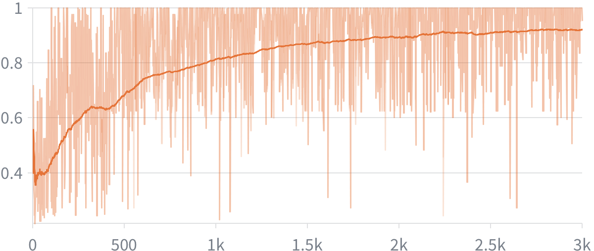

# Practice is All You Need

Small language models on math: we compare three setups:

1. **Pure RL** — Reinforcement learning from scratch on a base model (R1-zero).
2. **SFT** — Supervised fine-tuning on reasoning traces from a strong model, applied to math questions on the same base model.
3. **SFT + RL (cold start)** — SFT on reasoning traces first, then applying RL (GRPO) to the fine-tuned model.

## Results

### Reward during GRPO training



Training runs for **3k steps**. The **thin** line is raw reward each step (noisy because completions are sampled). The **thick** line is a smoothed moving average of that signal. Later on the dataset **saturates**—the model starts getting **100%** average reward too often—so the smoothed curve flattens at the top.

### GSM8K accuracy: base, SFT-distill, and reasoning model


**pass@1** / **maj@16** (majority over 16): Reasoning **82.0%** / **88.1%**, SFT-distill **72.9%** / **82.6%**, base **53.3%** / **75.9%**. Reasoning wins on both; its pass@1 is close to SFT-distill’s maj@16.

---

## Getting Started

1. Create and activate a virtual environment (e.g. `rlvr`).
2. Install dependencies:
   ```bash
   pip install -r requirements.txt
   ```
* If working on a lab computer, it is reccomended to use the venv from `TDDE09` instead to save memory:
   ```bash
   source /courses/TDDE09/venv/bin/activate
   ```
3. To use the kernel in Jupyter notebooks, run:
   ```bash
   python -m ipykernel install --user --name rlvr --display-name "rlvr"
   ```
   Then select "rlvr" as the kernel when opening notebooks.

---

## Supervised Fine-Tuning (SFT)

### Overview

SFT teaches the base model to produce responses in the expected format —
`<think>chain-of-thought</think><answer>final_answer</answer>` — before any
reinforcement learning is applied. Without this warm-start the model never
generates the correct tags, so GRPO has nothing to reinforce.

The pipeline has two stages:

```
Base model  ──[SFT on GSM8K]──►  SFT model  ──[GRPO]──►  Final model
              learns format                    learns to
              + reasoning style                reason correctly
```

---

### Data — `GSM8KSFTDataset`

**File:** `data/gsm8k.py`

Each GSM8K example contains a question and a full solution ending in `#### <answer>`.
`GSM8KSFTDataset` reformats these into supervised training examples:

```
prompt:      "A conversation between User and Assistant... User: <question> Assistant:"
completion:  "<think>\n<chain-of-thought>\n</think>\n<answer><final_answer></answer>"
```

Tokenization is done in two separate passes (prompt then completion) so the
boundary between them is exact. The labels tensor is `-100` for all prompt
tokens, so the cross-entropy loss is only computed on the completion. Examples
longer than `max_length` tokens are dropped.

**Usage:**
```python
from data.gsm8k import GSM8KSFTDataset

train_sft = GSM8KSFTDataset(
    tokenizer=tokenizer,
    prompt_template=generate_prompt,
    split="train",
    max_length=384,
)
```

---

### LoRA — `utils/lora.py`

Full fine-tuning a 1.7B model requires ~17 GB of VRAM (weights + gradients +
Adam optimizer states). LoRA (Low-Rank Adaptation) reduces this dramatically by
freezing all base weights and injecting small trainable matrices into the
attention layers.

For each targeted linear layer `W`, LoRA adds:

```
output = W·x  +  (B · A · x) · (alpha / r)
```

where `A ∈ R^(r×d_in)` and `B ∈ R^(d_out×r)` are the only trained parameters.
`B` is initialized to zero so the adapter starts as an identity — the model
behaves exactly like the base model at the start of training.

| | Full fine-tune | LoRA (r=16) |
|---|---|---|
| Trainable params | ~1.7 B | ~8 M (~0.5 %) |
| Optimizer states | ~6.8 GB | ~32 MB |
| Saved checkpoint | ~3.4 GB | ~16 MB |

Default target modules for Qwen / LLaMA style models:
`q_proj`, `k_proj`, `v_proj`, `o_proj`

**Usage:**
```python
from utils.lora import apply_lora, save_lora, load_lora

model = apply_lora(model, r=16, alpha=32, dropout=0.05)
# ... train ...
save_lora(model, "/path/to/adapter")   # saves lora_adapter.pt only

# To reload later:
model = apply_lora(base_model, r=16, alpha=32)
model = load_lora(model, "/path/to/adapter")
```

---

### Training — `SFTTrainer`

**File:** `training/sft.py`
**Config:** `training/configs.py` → `SFTConfig`

The trainer runs a standard cross-entropy loop with two memory optimisations:

**Gradient accumulation** — runs several small forward passes before each
optimizer step, achieving a larger effective batch size without the memory cost:

```
effective_batch_size = batch_size × grad_accum_steps
```

**Gradient checkpointing** — recomputes activations during the backward pass
instead of storing them, trading a small amount of compute for a large reduction
in activation memory.

**Config defaults:**

| Parameter | Default | Description |
|---|---|---|
| `lr` | `5e-5` | Learning rate |
| `epochs` | `3` | Training epochs |
| `batch_size` | `2` | Examples per forward pass |
| `grad_accum_steps` | `4` | Effective batch = 2 × 4 = 8 |
| `max_length` | `384` | Max tokens per example |
| `grad_clip` | `1.0` | Gradient norm clip |
| `gradient_checkpointing` | `True` | Recompute activations |
| `use_lora` | `True` | Enable LoRA |
| `lora_r` | `16` | LoRA rank |
| `lora_alpha` | `32` | LoRA scale (alpha/r = 2.0) |
| `eval_every` | `200` | Steps between evaluations |

**Usage:**
```python
from training.sft import SFTTrainer
from training.configs import SFTConfig

config = SFTConfig(lr=2e-5, epochs=3, batch_size=2, grad_accum_steps=4)
trainer = SFTTrainer(model=model, tokenizer=tokenizer, config=config)
trainer.train(train_sft, eval_dataset=eval_sft, run_name="Qwen/Qwen3-1.7B-Base-gsm8k-sft")
```

After training, `plot_losses()` is called automatically to display the training
and evaluation loss curves.

---

### Notebook

See `notebooks/sft.ipynb` for a full walkthrough:
1. Load the base model
2. Build `GSM8KSFTDataset`
3. Configure and run `SFTTrainer`
4. Evaluate format quality with `evaluate()`
